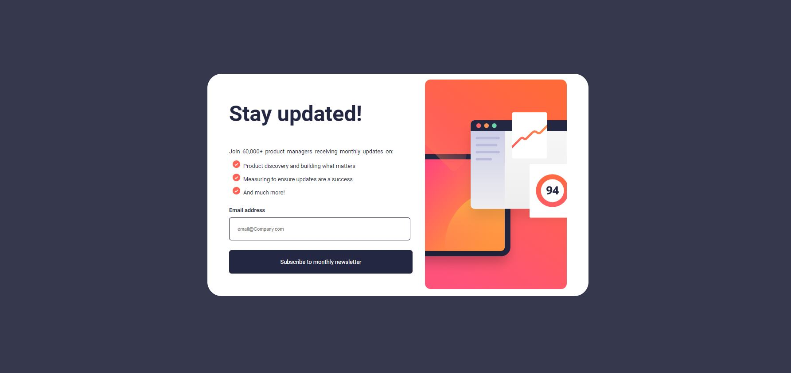

# Newsletter sign-up form with success message

## Table of contents

- [Overview](#overview)
  - [The challenge](#the-challenge)
  - [Screenshot](#screenshot)
  - [Links](#links)
- [My process](#my-process)
  - [Built with](#built-with)
  - [What I learned](#what-i-learned)
  - [Continued development](#continued-development)
  - [Useful resources](#useful-resources)
- [Author](#author)
- [Acknowledgments](#acknowledgments)

## Overview

### The challenge
This challenge is to build out a business newsletter form that contain an email input with a validation.

Users should be able to:

- See hover and focus states for all interactive elements on the page
- After submitting, you'll be transfered to a thanks page.

### Screenshot

### Links

- Solution URL: [solution](https://www.frontendmentor.io/solutions/responsive-newsletter-a1SCKJB9Rv)
- Live Site URL: [Live Site](https://business-news-letter.vercel.app)

### Building your project

1. Initialize The project as a public repository on [GitHub](https://github.com/). Creating a repo will make it easier to share your code with the community .
2. Configure the repository to publish your code to a web address. 
3. I Look through the designs to start planning out how i'll tackle the project. This step is crucial to help you think ahead for CSS classes to create reusable styles.
4. Before adding any styles, I structure the content with HTML. Writing the HTML first can help focus your attention on creating well-structured content.
5. I Write out the base styles for the project, including general content styles, such as `font-family` and `font-size`.
6. Start adding styles to the top of the page and work down. Only I move on to the next section once am happy with completing the area am working on.
7. Add the javascript code for interaction

### Deploying your project

There are many ways to host your project for free.

- [GitHub Pages](https://pages.github.com/)
- [Vercel](https://vercel.com/)
- [Netlify](https://www.netlify.com/)

### Built with

- Semantic HTML5 markup
- CSS custom properties
- JavaScript
- Flexbox
- Mobile-first workflow

## Author

- Website - akchouche Mouhamed Amine(https://port-4391f.web.app/)
- Frontend Mentor - [@Mouhamed-Amine](https://www.frontendmentor.io/profile/yourusername)
- LinkedIn - (https://www.linkedin.com/in/mouhamed-amine-531036187/)

## Acknowledgments

I wanna thank all the youtube channels creator and books i've read to make myself understand and be able to build such a page.
